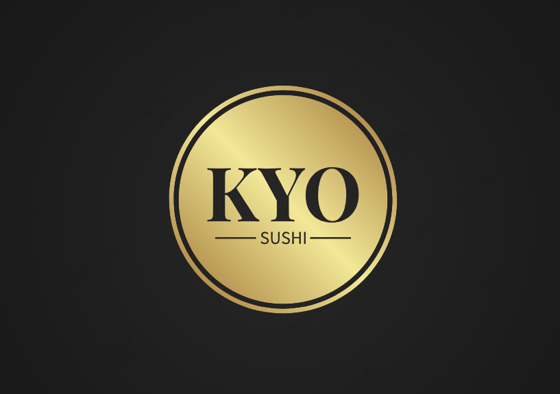

# Kyo Sushi - Ristorante Fusion Italo-Giapponese



## 📑 Descrizione

Kyo Sushi è un sito web per un ristorante fusion italo-giapponese situato nel cuore di Milano. Il sito è sviluppato con React e mette in risalto l'unicità del ristorante che combina la tradizione culinaria giapponese con ingredienti e sapori italiani di alta qualità.

## 🚀 Funzionalità

- **Design Responsive**: Completamente adattabile a dispositivi desktop e mobile
- **Animazioni Fluide**: Implementate con la libreria AOS (Animate On Scroll)
- **Navigazione Smooth Scroll**: Per un'esperienza utente piacevole
- **Galleria Interattiva**: Con lightbox per visualizzare le immagini ingrandite
- **Form di Prenotazione**: Per prenotare un tavolo con feedback visivo
- **Menu Interattivo**: Categorizzato e con evidenziazione dei piatti popolari
- **Carosello Testimonial**: Slider automatico per le recensioni dei clienti

## 🛠️ Tecnologie Utilizzate

- **React**: Libreria JavaScript per la costruzione dell'interfaccia utente
- **React Scroll**: Per la navigazione smooth scroll
- **AOS**: Per le animazioni al caricamento
- **CSS Personalizzato**: Stili completamente personalizzati
- **Font Awesome**: Per le icone
- **Google Maps**: Per l'integrazione della mappa

## 📁 Struttura del Progetto

```
kyo-sushi/
├── public/
│   ├── images/
│   │   ├── gallery/
│   │   │   └── (immagini della galleria)
│   │   ├── testimonials/
│   │   │   └── (immagini delle recensioni)
│   │   └── (altre immagini)
│   └── menu-completo.pdf
├── src/
│   ├── components/
│   │   ├── About.jsx
│   │   ├── Contact.jsx
│   │   ├── Footer.jsx
│   │   ├── Gallery.jsx
│   │   ├── Header.jsx
│   │   ├── Home.jsx
│   │   ├── Menu.jsx
│   │   ├── Preloader.jsx
│   │   └── Testimonials.jsx
│   ├── styles/
│   │   ├── About.css
│   │   ├── App.css
│   │   ├── Contact.css
│   │   ├── Footer.css
│   │   ├── Gallery.css
│   │   ├── Header.css
│   │   ├── Home.css
│   │   ├── Menu.css
│   │   └── Testimonials.css
│   ├── App.jsx
│   └── index.js
├── package.json
└── README.md
```

## 🔧 Installazione e Avvio

1. Clona il repository:

```bash
git clone https://github.com/tuousername/kyo-sushi.git
cd kyo-sushi
```

2. Installa le dipendenze:

```bash
npm install
```

3. Avvia l'applicazione in modalità sviluppo:

```bash
npm start
```

4. Apri [http://localhost:3000](http://localhost:3000) per visualizzare il sito nel browser.

## 📝 Note per lo Sviluppo

- **Immagini**: Assicurati che tutte le immagini siano posizionate correttamente nella cartella `/public/images/` seguendo la struttura indicata.
- **Personalizzazione**: Modifica i contenuti nelle componenti React per personalizzare testi, immagini e informazioni del ristorante.
- **Animazioni**: Puoi modificare le impostazioni delle animazioni AOS nel file `App.jsx`.

## 🔍 SEO e Performance

Il sito è ottimizzato per:

- **Velocità di caricamento**: Con un preloader per migliorare la percezione dell'utente
- **Responsive Design**: Per un'esperienza ottimale su qualsiasi dispositivo
- **Accessibilità**: Struttura semantica per migliorare l'accessibilità
- **SEO**: Meta tag appropriati e struttura del contenuto ottimizzata

## 📱 Funzionalità Social e Contatti

- Integrazione con profili social (Facebook, Instagram, Twitter, TripAdvisor)
- Form per iscrizione alla newsletter
- Mappa interattiva con la posizione del ristorante
- Form di contatto e prenotazioni

## 📊 To-Do e Miglioramenti Futuri

- [ ] Aggiungere internazionalizzazione (supporto multilingua)
- [ ] Implementare un sistema di prenotazione online collegato a un database
- [ ] Aggiungere una sezione blog con notizie ed eventi
- [ ] Implementare una funzione di ordinazione online per l'asporto

## 📄 Licenza

Questo progetto è concesso in licenza secondo i termini della licenza MIT.
